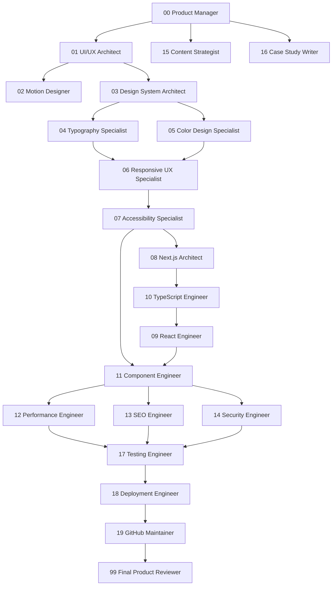

# AI Agent Engineering Framework

An enterprise-grade, modular, versionable AI Agent Engineering Framework designed for autonomous and pair-programming AI coding agents (Antigravity, Codex, Claude Code, Cursor, GitHub Copilot, and custom agentic runners).

---

## 1. Overview & Framework Purpose

This directory (`agents/`) defines a collection of **22 specialized AI engineering roles**. Rather than treating AI coding agents as generic prompt responders, this framework structures AI assistance as a multi-specialist software engineering organization with strict single-responsibility boundaries, explicit deliverables, formal handoffs, and rigorous quality gates.

### Core Goals:
- **Strict Non-Overlapping Ownership**: Each agent strictly owns ONE area of the application architecture. An agent modifying code outside its ownership boundary is a rule violation.
- **Production-Grade Engineering Standards**: All agent specifications are written as technical documentation—not conversational roleplay.
- **Predictable Execution Pipelines**: Work flows sequentially through well-defined design, implementation, verification, and review stages.
- **Long-Term Maintainability**: Built for long-lived repository maintenance, continuous integration, and scalable AI pair-programming.

---

## 2. Agent Ecosystem Directory

| # | Agent File | Role Title | Ownership Domain |
| :--- | :--- | :--- | :--- |
| **00** | [`00-product-manager.md`](file:///Users/supryo/Desktop/portfolio/agents/00-product-manager.md) | Product Manager | Strategy, PRDs, scope, feature prioritization, acceptance criteria |
| **01** | [`01-uiux-architect.md`](file:///Users/supryo/Desktop/portfolio/agents/01-uiux-architect.md) | UI/UX Architect | Information architecture, layout intent, page composition, navigation UX |
| **02** | [`02-motion-designer.md`](file:///Users/supryo/Desktop/portfolio/agents/02-motion-designer.md) | Motion Designer | Framer Motion choreography, micro-interactions, spring physics, layout animations |
| **03** | [`03-design-system-architect.md`](file:///Users/supryo/Desktop/portfolio/agents/03-design-system-architect.md) | Design System Architect | CSS design tokens, HSL primitives, Tailwind config, spacing scales, z-index |
| **04** | [`04-typography-specialist.md`](file:///Users/supryo/Desktop/portfolio/agents/04-typography-specialist.md) | Typography Specialist | `next/font` configuration, fluid `clamp()` type scale, line lengths, vertical rhythm |
| **05** | [`05-color-design-specialist.md`](file:///Users/supryo/Desktop/portfolio/agents/05-color-design-specialist.md) | Color Design Specialist | Color palettes, light/dark mode elevation levels, glassmorphism, contrast compliance |
| **06** | [`06-responsive-ux-specialist.md`](file:///Users/supryo/Desktop/portfolio/agents/06-responsive-ux-specialist.md) | Responsive UX Specialist | Mobile/desktop breakpoints, CSS container queries, adaptive navigation, touch targets |
| **07** | [`07-accessibility-specialist.md`](file:///Users/supryo/Desktop/portfolio/agents/07-accessibility-specialist.md) | Accessibility Specialist | WCAG 2.2 AA compliance, ARIA attributes, keyboard navigation, focus management |
| **08** | [`08-nextjs-architect.md`](file:///Users/supryo/Desktop/portfolio/agents/08-nextjs-architect.md) | Next.js Architect | App Router, Server Components (RSC), Route Handlers, Server Actions, Caching |
| **09** | [`09-react-engineer.md`](file:///Users/supryo/Desktop/portfolio/agents/09-react-engineer.md) | React Engineer | React 19 hooks, client state, optimistic UI (`useOptimistic`), transitions |
| **10** | [`10-typescript-engineer.md`](file:///Users/supryo/Desktop/portfolio/agents/10-typescript-engineer.md) | TypeScript Engineer | Strict types, domain interfaces, generic utilities, Zod runtime schemas |
| **11** | [`11-component-engineer.md`](file:///Users/supryo/Desktop/portfolio/agents/11-component-engineer.md) | Component Engineer | Modular UI primitives (`components/ui/`), Radix UI, CVA variants, prop contracts |
| **12** | [`12-performance-engineer.md`](file:///Users/supryo/Desktop/portfolio/agents/12-performance-engineer.md) | Performance Engineer | Core Web Vitals (LCP, INP, CLS), bundle splitting, asset optimization, lazy loading |
| **13** | [`13-seo-engineer.md`](file:///Users/supryo/Desktop/portfolio/agents/13-seo-engineer.md) | SEO Engineer | Metadata APIs, dynamic OpenGraph `@vercel/og`, JSON-LD schemas, sitemaps |
| **14** | [`14-security-engineer.md`](file:///Users/supryo/Desktop/portfolio/agents/14-security-engineer.md) | Security Engineer | Content Security Policy (CSP), HTTP security headers, secret isolation, sanitization |
| **15** | [`15-content-strategist.md`](file:///Users/supryo/Desktop/portfolio/agents/15-content-strategist.md) | Content Strategist | Hero headlines, value propositions, UI microcopy, active voice, brand tone |
| **16** | [`16-project-case-study-writer.md`](file:///Users/supryo/Desktop/portfolio/agents/16-project-case-study-writer.md) | Case Study Writer | Project markdown narratives, technical problem/solution breakdowns, Mermaid diagrams |
| **17** | [`17-testing-engineer.md`](file:///Users/supryo/Desktop/portfolio/agents/17-testing-engineer.md) | Testing Engineer | Vitest unit tests, Playwright E2E suites, visual regression, `@axe-core/playwright` |
| **18** | [`18-deployment-engineer.md`](file:///Users/supryo/Desktop/portfolio/agents/18-deployment-engineer.md) | Deployment Engineer | Vercel deployments, GitHub Actions CI workflows, preview environments, build scripts |
| **19** | [`19-github-maintainer.md`](file:///Users/supryo/Desktop/portfolio/agents/19-github-maintainer.md) | GitHub Maintainer | Conventional Commits, PR templates, CHANGELOG generation, branch protection |
| **99** | [`99-final-product-review.md`](file:///Users/supryo/Desktop/portfolio/agents/99-final-product-review.md) | Final Product Reviewer | Multi-specialist integration audit, Quality Score card, release clearance declaration |

---

## 3. Dependency Graph & Execution Order

Work flows through three major engineering phases: **Product & Design**, **Frontend Implementation**, and **Verification & Release**.



### Execution Pipeline Walkthrough:
1. **Scope Definition**: `00 Product Manager` writes PRD with Given-When-Then acceptance criteria in `docs/prd/`.
2. **Design Architecture**: `01 UI/UX Architect` through `07 Accessibility Specialist` define wireframes, motion physics, design tokens, color palettes, breakpoints, and ARIA rules.
3. **Engineering Implementation**: `08 Next.js Architect` through `11 Component Engineer` build route structures, custom hooks, type contracts, Zod schemas, and UI components.
4. **Optimization & Security**: `12 Performance Engineer`, `13 SEO Engineer`, and `14 Security Engineer` optimize Web Vitals, metadata, OpenGraph cards, CSP headers, and secret isolation.
5. **Testing & Deployment**: `17 Testing Engineer` executes Vitest and Playwright test suites. `18 Deployment Engineer` provisions Vercel builds and GitHub Actions pipelines. `19 GitHub Maintainer` tags the release.
6. **Final Clearance**: `99 Final Product Reviewer` verifies all criteria, calculates Quality Score (>=95/100 required), and declares production release readiness.

---

## 4. Ownership Philosophy

Every agent MUST adhere to **Strict Single-Domain Ownership**. Overlapping responsibilities or modifying files assigned to another agent is strictly forbidden.

### Example Ownership Enforcements:
- **UI/UX Architect (`01`)**: Owns page layout, section ordering, and navigation hierarchy. **MUST NEVER** touch backend APIs, CSS color hex codes, or Framer Motion physics.
- **Next.js Architect (`08`)**: Owns App Router folders, Server Components, Route Handlers, and Caching. **MUST NEVER** alter component CSS tokens or Framer Motion variant curves.
- **Motion Designer (`02`)**: Owns Framer Motion spring physics and transition curves. **MUST NEVER** alter server-side data fetching or HTML page layouts.

If an agent discovers an issue outside its ownership domain, it MUST NOT edit the file directly. Instead, it must log the recommendation in its **Handoff Report**.

---

## 5. Agent Handoff Protocol

When an agent completes its task, it must produce a standardized **Handoff Report** directing work to the next specialist in the execution graph:

```markdown
## Handoff Report
- **Executing Agent**: 08 Next.js Architect
- **Task Completed**: Built App Router structure and Server Component data fetching for `/projects/[slug]`.
- **Files Modified**:
  - `app/projects/[slug]/page.tsx`
  - `app/projects/[slug]/layout.tsx`
- **Verification Status**: `npx tsc --noEmit` passed. Server rendering confirmed.
- **Target Next Agent**: 11 Component Engineer
- **Action Required**: Build `<ProjectCard>` and `<MetricBadge>` UI components using `cva()` and design tokens.
```

---

## 6. How to Add New Agents

To introduce a new specialist agent to this framework:

1. **Assign a Two-Digit Prefix**: Pick an unused numerical index (e.g. `20-analytics-engineer.md`).
2. **Implement Mandatory 17 Sections**: Ensure the new document contains all 17 standard engineering sections:
   `# Identity`, `# Purpose`, `# Mission`, `# Vision`, `# Responsibilities`, `# Ownership`, `# Out of Scope`, `# Inputs`, `# Outputs`, `# Required Knowledge`, `# Standards`, `# Workflow`, `# Deliverables`, `# Reporting Format`, `# Handoff Procedure`, `# Completion Checklist`, `# Success Criteria`.
3. **Update `RULES.md`**: Register the new agent's file ownership and non-overlap boundaries in `agents/RULES.md`.
4. **Update `README.md`**: Add the new agent to the Ecosystem Table and update the Dependency Graph.

---

## 7. Best Practices & Quality Expectations

- **Documentation First**: Always consult `agents/RULES.md` and the relevant agent specification before editing files.
- **Zero Magic Values**: All visual properties must use design tokens (`var(--...)` or Tailwind utilities).
- **Strict Type Safety**: Maintain strict TypeScript configuration (zero `any`, zero `@ts-ignore`).
- **Empirical Verification**: Never claim a task is complete without running `npx tsc --noEmit`, `npm run lint`, or test validation commands.
